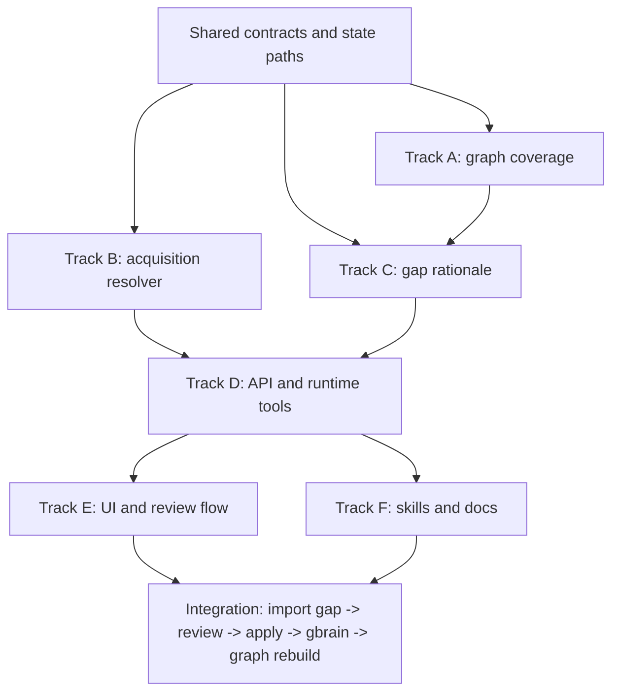

# Research Library Enrichment Plan

Date: 2026-04-24

## Purpose

ScienceSwarm should help a research agent understand a project paper library,
find important missing papers, obtain legally available full text when possible,
and integrate the result back into gbrain and the Paper Library without creating
a parallel research store.

The user-facing outcome is:

1. A local paper archive is scanned and resolved into canonical paper identities.
2. ScienceSwarm builds a citation and knowledge graph from local papers plus
   trusted external metadata.
3. Missing referenced or bridging papers are ranked with evidence for why they
   matter.
4. A user can approve acquisition of open-access PDFs or metadata-only records.
5. Imported papers become first-class local library items, gbrain paper pages,
   and graph nodes with provenance.
6. Claude Code, OpenClaw, Codex, Gemini CLI, and hosted frontier APIs can reason
   over the same graph through the existing runtime privacy gates.

## Design Principles

- Keep `gbrain` as the durable knowledge layer, `OpenClaw` as the manager, and
  Paper Library as the project-scoped local archive workflow.
- Prefer deterministic scholarly APIs before model judgment. Models should
  explain, prioritize, and supervise; they should not be the source of truth for
  identifiers, files, or writeback.
- Use legal acquisition only. Do not bypass paywalls, scrape restricted
  publisher content, or hide license uncertainty.
- Require explicit approval before downloading files, mutating the local
  archive, sending hosted context, or writing runtime-generated artifacts.
- Preserve provenance for every graph edge, gap score, acquisition source,
  runtime prompt, imported file, and gbrain write.
- Avoid sending raw PDFs to hosted systems by default. Start with metadata,
  abstracts, citations, local excerpts, and graph summaries; escalate only after
  a runtime preview approval.

## Current Foundation

Paper Library already has most of the right bones:

- `src/lib/paper-library/contracts.ts` defines scan, review, apply, graph,
  cluster, gap, enrichment-cache, and embedding-cache contracts.
- `src/lib/paper-library/jobs.ts` scans local PDFs, extracts text, resolves
  identity candidates, enriches metadata, and writes review shards.
- `src/lib/paper-library/graph.ts` builds local paper nodes, external paper
  nodes, references, citations, bridge suggestions, source runs, and cache
  entries through `PaperLibraryGraphAdapter`.
- `src/lib/paper-library/gaps.ts` ranks missing papers by citation frequency,
  bridge position, cluster coverage, recency, and source disagreement.
- `src/lib/paper-library/gbrain-writer.ts` writes applied local PDF locations
  into gbrain paper pages.
- `src/lib/skills/db-*` exposes deterministic PubMed, arXiv, Crossref,
  OpenAlex, and Semantic Scholar wrappers with rate limits and persistence.
- `src/lib/research-packets/` can already build multi-source literature packets
  and journaled runs.
- `src/lib/runtime-hosts/` already provides host profiles, privacy previews,
  local-only/cloud/execution policy gates, runtime sessions, scoped MCP, and
  gbrain writeback provenance.

The largest existing gap is that a Paper Library gap suggestion can only be
marked `imported`; it does not resolve open-access locations, download a PDF,
ingest it, create a local review item, or reconcile the imported paper back into
the graph.

## Proposed Architecture

### 1. Canonical Graph Ledger

Extend the existing `PaperLibraryGraph` rather than adding a new graph store.
Every local and external node should have a deterministic identity:

- DOI, arXiv ID, PMID, and OpenAlex ID remain canonical identifiers.
- Local files add `paperIds`, source snapshots, gbrain slugs, and file refs.
- External nodes carry sources, evidence strings, reference/citation counts, and
  acquisition state.
- Edges carry source and evidence, and can be rebuilt without losing reviewed
  user states.

The graph should support multiple adapters:

- Semantic Scholar for references and citations, using the current adapter.
- OpenAlex as a second graph source for works, references, concepts, and open
  access locations.
- Crossref and PubMed for metadata validation and DOI/PMID resolution.
- Optional local bibliography extraction from PDFs when external graph coverage
  is thin.
- Optional plugins for domain-specific sources.

### 2. Gap Value Model

Keep deterministic scoring in `gaps.ts`, but add a separate rationale layer.
The score should remain explainable without an LLM:

- How many local papers cite or are cited by this paper?
- Does it connect two or more semantic clusters?
- Is it a highly connected paper near a recent local paper?
- Is it likely a canonical method, dataset, review, retraction notice, or
  predecessor?
- Are sources in disagreement?
- Can ScienceSwarm legally obtain a PDF, or only metadata?

Model-generated rationale should be stored as an optional annotation with
provenance, never as the ranking source of truth.

### 3. Acquisition Planner

Introduce an acquisition planner for one or more `GapSuggestion` items. It
should produce a plan, not mutate files immediately.

Candidate open-access sources, in order:

1. Existing local duplicate by identifier or title similarity.
2. arXiv PDF when an arXiv ID is known.
3. PubMed Central or PubMed full-text links when available.
4. OpenAlex best open-access locations.
5. Semantic Scholar open-access PDF locations.
6. Unpaywall, configured with a user-provided email.
7. Publisher landing-page metadata only, when no open PDF is available.

The plan should include title, identifiers, source URLs, license/open-access
status when known, confidence, expected destination, and why the paper is worth
adding. If a PDF is not legally available, the plan can still offer a
metadata-only gbrain paper page and a watch state.

### 4. Acquisition Inbox

Downloaded files should land in a project-scoped acquisition inbox, then flow
through the normal Paper Library review/apply path.

Recommended flow:

1. User selects one or more gap suggestions.
2. ScienceSwarm creates an acquisition plan.
3. User approves the plan.
4. ScienceSwarm downloads open PDFs into a project-controlled inbox and records
   immutable source/provenance metadata.
5. The inbox is scanned as a Paper Library source, producing review items.
6. Accepted imports are applied with the existing approval-token flow.
7. gbrain pages are updated with local file refs, graph provenance, and gap
   import provenance.
8. Graph, clusters, and gaps are rebuilt so the imported paper becomes local.

This keeps acquisition reversible and makes the imported paper pass through the
same review controls as user-provided PDFs.

### 5. Agent Interfaces

Claude Code should understand the library through scoped project context and
Paper Library tools, not by crawling arbitrary files.

Add host-neutral operations that both OpenClaw skills and hosted/runtime agents
can call:

- `paper_library_graph_refresh(project, scanId)`
- `paper_library_gap_rank(project, scanId)`
- `paper_library_acquisition_plan(project, scanId, suggestionIds)`
- `paper_library_acquisition_apply(project, planId, approvalToken)`
- `paper_library_gap_explain(project, scanId, suggestionId, runtimeHost?)`

For OpenClaw, expose these as skills/plugins backed by deterministic local
tools. For Claude Code, expose them through the existing runtime-scoped MCP
profile and generated `SCIENCESWARM.md` capsule. For hosted OpenAI, Anthropic,
and Gemini APIs, route through the runtime host privacy preview system with
explicit `RuntimeDataIncluded` entries for graph summaries, abstracts, excerpts,
source URLs, and any selected PDF content.

Hosted tools are useful for gap explanation and web-grounded triage:

- OpenAI Responses API supports hosted tools such as web search, file search,
  function calling, and remote MCP.
- Anthropic supports web search, citations, tool use, MCP, and Claude Code MCP
  prompts.
- Gemini supports Google Search grounding, URL context, function calling, and
  Vertex AI Search grounding.

Those capabilities should sit behind ScienceSwarm-owned acquisition and
writeback contracts. The stable system should remain deterministic even when a
hosted tool is unavailable.

Reference docs checked for this planning pass:

- OpenAI Responses/tools:
  <https://platform.openai.com/docs/guides/tools>
- OpenAI web search:
  <https://platform.openai.com/docs/guides/tools-web-search?api-mode=responses>
- Anthropic web search:
  <https://docs.anthropic.com/en/docs/agents-and-tools/tool-use/web-search-tool>
- Claude Code MCP:
  <https://docs.anthropic.com/en/docs/claude-code/mcp>
- Gemini Google Search grounding:
  <https://ai.google.dev/gemini-api/docs/google-search>
- Vertex AI URL context:
  <https://cloud.google.com/vertex-ai/generative-ai/docs/url-context>

## Data Contracts To Add

Add contracts in `src/lib/paper-library/contracts.ts`.

### `OpenAccessLocation`

Fields:

- `id`
- `source`: `arxiv | pubmed | pmc | openalex | semantic_scholar | unpaywall | publisher`
- `url`
- `pdfUrl?`
- `landingUrl?`
- `license?`
- `openAccessStatus`: `open | closed | unknown`
- `confidence`
- `evidence`

Invariant: `pdfUrl` may be used for download only when
`openAccessStatus === "open"` or the source is known to be legally open, such as
arXiv.

### `PaperLibraryAcquisitionPlan`

Fields:

- `version`
- `id`
- `project`
- `scanId`
- `status`: `draft | validated | approved | acquiring | acquired | partial | blocked | failed | canceled`
- `suggestionIds`
- `items`
- `createdAt`
- `updatedAt`
- `approvalTokenHash?`
- `approvalExpiresAt?`

Invariant: plans are immutable after approval except for status and result
fields.

### `PaperLibraryAcquisitionItem`

Fields:

- `id`
- `suggestionId`
- `nodeId`
- `title`
- `identifiers`
- `locations`
- `selectedLocationId?`
- `mode`: `pdf | metadata_only | watch`
- `destinationRelativePath?`
- `reason`
- `riskCodes`
- `confidence`
- `result?`

Invariant: `mode === "pdf"` requires a selected open PDF location.

### `PaperLibraryAcquisitionResult`

Fields:

- `itemId`
- `status`: `downloaded | metadata_persisted | already_local | skipped | failed`
- `downloadedPath?`
- `gbrainSlug?`
- `fileRef?`
- `error?`
- `provenance`

Invariant: result provenance includes source URL, fetch time, checksum, and the
approved plan id.

## File Inventory

Create:

- `src/lib/paper-library/acquisition.ts` - plan, approve, execute, and persist
  acquisition runs.
- `src/lib/paper-library/open-access.ts` - source adapters for arXiv, PMC,
  OpenAlex, Semantic Scholar, Unpaywall, and metadata-only fallbacks.
- `src/lib/paper-library/gap-rationale.ts` - deterministic rationale and
  optional model annotation contract helpers.
- `src/lib/paper-library/graph-adapters/openalex.ts` - OpenAlex graph adapter.
- `src/app/api/brain/paper-library/acquisition/route.ts` - create/read/approve
  plans and start execution.
- `tests/lib/paper-library/acquisition.test.ts`
- `tests/lib/paper-library/open-access.test.ts`
- `tests/routes/paper-library-acquisition-route.test.ts`

Modify:

- `src/lib/paper-library/contracts.ts` - acquisition, open-access, rationale,
  and enriched gap contracts.
- `src/lib/paper-library/state.ts` - acquisition plan/run paths.
- `src/lib/paper-library/graph.ts` - adapter composition and imported-node
  reconciliation.
- `src/lib/paper-library/gaps.ts` - acquisition state, rationale, and imported
  node refresh.
- `src/lib/paper-library/gbrain-writer.ts` - graph/acquisition provenance on
  paper pages.
- `src/components/research/paper-library/command-center.tsx` - plan/import
  controls and evidence display.
- `src/lib/runtime-hosts/mcp/tools.ts` and
  `src/lib/runtime-hosts/mcp/tool-profiles.ts` - scoped Paper Library tools for
  runtime agents.
- `src/brain/mcp-server.ts` - public MCP tool registration when appropriate.
- `skills/*` host projections - OpenClaw/Codex/Claude skill guidance for
  library enrichment.

## Parallel-Safe Decomposition

### Shared Contracts

Files:

- `src/lib/paper-library/contracts.ts`
- `src/lib/paper-library/state.ts`
- contract tests in `tests/lib/paper-library/contracts.test.ts`

This PR must merge first. Every other track depends on these Zod schemas and
state paths.

### Track A: Graph Coverage

Files:

- `src/lib/paper-library/graph.ts`
- `src/lib/paper-library/graph-adapters/openalex.ts`
- `tests/lib/paper-library/graph.test.ts`

Consumes: shared graph/acquisition contract extensions.

Produces: richer external nodes, source runs, and bridge suggestions.

### Track B: Acquisition Resolver

Files:

- `src/lib/paper-library/open-access.ts`
- `src/lib/paper-library/acquisition.ts`
- `tests/lib/paper-library/open-access.test.ts`
- `tests/lib/paper-library/acquisition.test.ts`

Consumes: `OpenAccessLocation`, `PaperLibraryAcquisitionPlan`, existing
`GapSuggestion`, enrichment cache, and DB wrappers.

Produces: validated acquisition plans and deterministic execution results.

### Track C: Gap Rationale And Scoring

Files:

- `src/lib/paper-library/gaps.ts`
- `src/lib/paper-library/gap-rationale.ts`
- `tests/lib/paper-library/gaps.test.ts`

Consumes: graph nodes, cluster membership, acquisition-state contracts.

Produces: stable reasons, evidence summaries, and optional model annotation
slots.

### Track D: API And Runtime Tools

Files:

- `src/app/api/brain/paper-library/acquisition/route.ts`
- `src/lib/runtime-hosts/mcp/tools.ts`
- `src/lib/runtime-hosts/mcp/tool-profiles.ts`
- `src/brain/mcp-server.ts`
- route and MCP tests

Consumes: acquisition resolver and shared contracts.

Produces: local API and scoped runtime-agent operations.

### Track E: UI And Review Flow

Files:

- `src/components/research/paper-library/command-center.tsx`
- focused component tests

Consumes: API contracts.

Produces: user-visible acquisition planning, approval, status, and evidence
controls.

### Track F: Skills And Documentation

Files:

- `skills/paper-library-enrichment/skill.json`
- `.openclaw/skills/paper-library-enrichment/SKILL.md`
- host projections for Claude/Codex when generated by the skill sync flow
- README or Paper Library docs

Consumes: public API and MCP contracts.

Produces: agent-facing instructions that use existing safety gates.

## Dependency Graph

## Merge Order

1. Shared contracts and state paths.
2. Graph coverage and acquisition resolver can proceed in parallel.
3. Gap rationale merges after graph coverage.
4. API/runtime tools merge after acquisition resolver and gap rationale.
5. UI and skills/docs merge after API contracts are stable.
6. Full integration and UAT last.

Parallelizability: moderate. The graph, acquisition, and scoring tracks can be
worked in parallel after shared contracts, but API and UI should wait for the
domain contracts to settle.

## Verification Plan

- Unit-test every new schema with parse/round-trip/error cases.
- Mock each open-access source and verify source priority, license uncertainty,
  checksum capture, retries, and negative results.
- Verify acquisition execution refuses closed/unknown PDF locations unless the
  mode is `metadata_only` or `watch`.
- Route-test local request guards, approval-token flow, idempotency, and stale
  plan rejection.
- Verify a full import flow with fixtures:
  gap suggestion -> acquisition plan -> open PDF download fixture -> review item
  -> apply plan -> gbrain page -> graph rebuild -> suggestion state imported.
- Verify hosted runtime calls cannot construct prompts under `local-only`, and
  that approved hosted explanations include exact `RuntimeDataIncluded`
  disclosures.
- Run `npm run test:related`, `npm run lint`, and `npm run typecheck` on
  implementation PRs. Use app preview only for UI changes.

## Open Decisions

- Whether the acquisition inbox stores PDFs beside the existing archive root,
  under the project workspace, or as gbrain file objects first.
- Whether to add Unpaywall in the first implementation or leave it as a plugin
  until an email/config surface exists.
- Whether local bibliography extraction should use a bundled parser, an
  optional GROBID/CERMINE-style service, or remain a later plugin.
- Whether Paper Library should canonicalize DB wrapper pages from `literature/`
  into the same slug space as applied local PDFs.
- Whether hosted model rationales should be stored on the gap suggestion itself
  or as linked runtime artifacts.

## Recommendation

Implement the deterministic acquisition loop first. It will make the existing
gap view materially useful without depending on any hosted provider. Then add
Claude Code/OpenClaw skill affordances over the same API, followed by optional
hosted frontier explanations for high-value gap triage.
